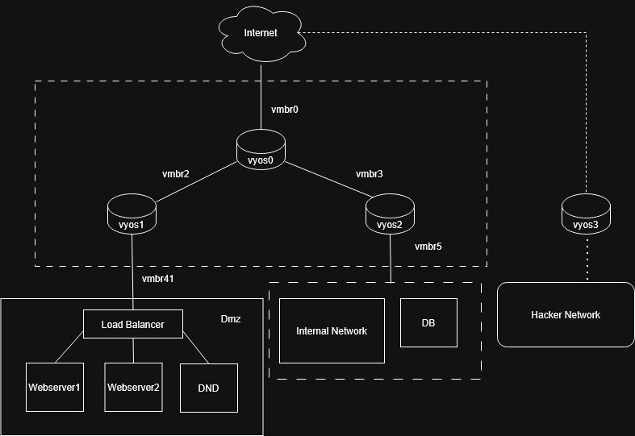
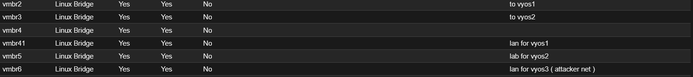

# Cyber Lab

##  Project Description
This project focuses on building a virtual cybersecurity lab environment using multiple virtual machines inside Proxmox.
The lab includes network segmentation, firewall configuration, and traffic control using VyOS.

##  Network Topology




 
## ⚙ VyOS Configuration
This section will document commands used for setting up vyos routers :

### Inteface setup

| VM Name     | IP Address (WAN)     | Lan IP
|-------------|----------------|-------------|
| Vyos0  | 172.18.49.x   | 192.168.10.1/24 , 192.168.20.1/24 |
| Vyos1      | 192.168.10.x (dhcp)  | 10.10.1.1/24     |
| Vyos2       | 192.168.29.x (dhcp)  | 10.10.2.1/24   |
| Vyos3   | 172.18.49.x | 10.10.3.1/24 |

#### Vyos0 
```
configure

set interfaces ethernet eth0 address 172.18.49.X/24
set interfaces ethernet eth1 address 192.168.10.1/24
set interfaces ethernet eth2 address 192.168.20.1/24

commit
save
```
#### DMZ lan network dhcp
```
configure

set service dhcp-server shared-network-name DMZ subnet 192.168.10.0/24 default-router 192.168.10.1
set service dhcp-server shared-network-name DMZ subnet 192.168.10.0/24 range 0 start 192.168.10.10
set service dhcp-server shared-network-name DMZ subnet 192.168.10.0/24 range 0 stop 192.168.19.250

commit
save

```

#### lan network dhcp
```
configure

set service dhcp-server shared-network-name lan subnet 192.168.20.0/24 default-router 192.168.20.0
set service dhcp-server shared-network-name lan subnet 192.168.20.0/24 range 0 start 192.168.20.10
set service dhcp-server shared-network-name lan subnet 192.168.20.0/24 range 0 stop 192.168.20.250

commit
save

```
#### NAT Configuration (Internet Access)
```
configure

set nat source rule 10 outbound-interface name eth0
set nat source rule 10 source address 192.168.0.0/16
set nat source rule 10 translation address masquerade

commit
save

```
#### Dhcp-server and dns (192.168.10.0/24)
```
configure

set service dhcp-server shared-network-name DMZ subnet 192.168.10.0/24 subnet-id 1
set service dhcp-server shared-network-name DMZ subnet 192.168.10.0/24 option default-router 192.168.10.1
set service dhcp-server shared-network-name DMZ subnet 192.168.10.0/24 option name-server 8.8.8.8
set service dhcp-server shared-network-name DMZ subnet 192.168.10.0/24 range 0 start 192.168.10.10
set service dhcp-server shared-network-name DMZ subnet 192.168.10.0/24 range 0 stop 192.168.10.250

commit
save
```

#### Dhcp-server and dns (192.168.20.0/24)
```
configure

set service dhcp-server shared-network-name lan subnet 192.168.20.0/24 subnet-id 2
set service dhcp-server shared-network-name lan subnet 192.168.20.0/24 option default-router 192.168.20.1
set service dhcp-server shared-network-name lan subnet 192.168.20.0/24 option name-server 8.8.8.8
set service dhcp-server shared-network-name lan subnet 192.168.20.0/24 range 0 start 192.168.20.10
set service dhcp-server shared-network-name lan subnet 192.168.20.0/24 range 0 stop 192.168.20.250

commit
save
```

#### Vyos1
```
configure

set interfaces ethernet eth0 address dhcp
set interfaces ethernet eth1 address 10.10.1.1/24

set service dhcp-server shared-network-name lan subnet 10.10.1.0/24 subnet-id 1
set service dhcp-server shared-network-name lan subnet 10.10.1.0/24 option default-router 10.10.1.1
set service dhcp-server shared-network-name lan subnet 10.10.1.0/24 option name-server 8.8.8.8
set service dhcp-server shared-network-name lan subnet 10.10.1.0/24 range 0 start 10.10.1.10
set service dhcp-server shared-network-name lan subnet 10.10.1.0/24 range 0 stop 10.10.1.250

set nat source rule 10 outbound-interface name eth0
set nat source rule 10 source address 10.10.1.0/24
set nat source rule 10 translation address masquerade


commit
save
```
### Vyos2
```
configure

set interfaces ethernet eth0 address dhcp
set interfaces ethernet eth1 address 10.10.2.1/24

set service dhcp-server shared-network-name lan subnet 10.10.2.0/24 subnet-id 1
set service dhcp-server shared-network-name lan subnet 10.10.2.0/24 option default-router 10.10.2.1
set service dhcp-server shared-network-name lan subnet 10.10.2.0/24 option name-server 8.8.8.8
set service dhcp-server shared-network-name lan subnet 10.10.2.0/24 range 0 start 10.10.2.10
set service dhcp-server shared-network-name lan subnet 10.10.2.0/24 range 0 stop 10.10.2.250

set nat source rule 10 outbound-interface name eth0
set nat source rule 10 source address 10.10.2.0/24
set nat source rule 10 translation address masquerade


commit
save
```
### Vyos3
```
configure

set interfaces ethernet eth0 address 172.18.49.x/24
set interfaces ethernet eth1 address 10.10.3.1/24

set service dhcp-server shared-network-name lan subnet 10.10.3.0/24 subnet-id 1
set service dhcp-server shared-network-name lan subnet 10.10.3.0/24 option default-router 10.10.2.1
set service dhcp-server shared-network-name lan subnet 10.10.3.0/24 option name-server 8.8.8.8
set service dhcp-server shared-network-name lan subnet 10.10.3.0/24 range 0 start 10.10.3.10
set service dhcp-server shared-network-name lan subnet 10.10.3.0/24 range 0 stop 10.10.3.250

set nat source rule 10 outbound-interface name eth0
set nat source rule 10 source address 10.10.3.0/24
set nat source rule 10 translation address masquerade


commit
save
```

